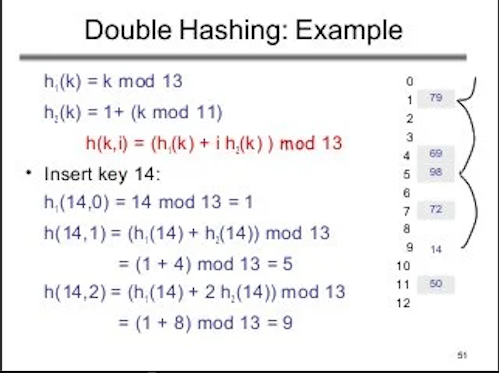
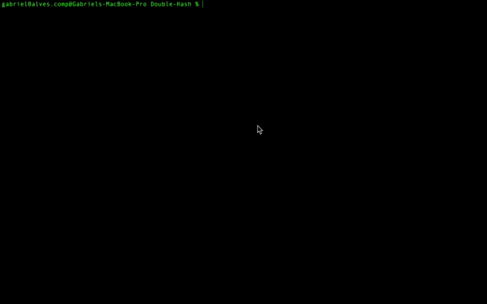

 <h1 align = "center" >Tabela Hash - Hash Duplo</h1>
 
 <h2> O que é uma Tabela Hash?</h2>

 <p align = "justify">
      A Tabela Hash ou Tabela de Dispersão é uma estrutura de dados especial que associa chaves de mapeamento a valores, para indexação de dados. É por meio de uma função matemática, conhecida como <i>Função Hash</i> ou <i>Função de Espelhamento</i>, que faz a associação de uma chave à uma posição. Entretanto, neste caso, foi utilizado duas funções hash para fazer a assosciação de chaves em caso colisões. O objetivo de uma Tabela Hash é, por meio de uma simples chave, fazer uma busca de forma rápida e assim, conseguir o valor desejado.<br>
      </p>

<h2>Colisões</h2>

<p align = "justify">
      Em uma Tabela Hash, quando uma posição já está ocupada, uma outra chave é associada a mesma posição, dizemos que há uma colisão. Para corrigir as colisões, neste repositório, foi implementado o método de <i>Endereçamento Aberto</i>, que não utiliza <i>Listas Encadaedas</i>. Dessa forma, espaço gasto com encadeamento é economizado e a colisão é tratada com uma nova busca na própria tabela para inserção. A figura 1 abaixo, demonstra como acontece as colisões no <i>Endereçamento Aberto</i> por meio de um Hash Duplo.
</p>

<p align = "center">
</img>
 <br>
Figura 1 - Exemplo de Colisão em Endereçamento Aberto utilizando Hash Duplo
</p>

<br>

<h2> O que é Hash Duplo? </h2>

<p align = "justify">
     O Hash Duplo é a implementação de duas funções de espelhamento que trabalham em conjunto quando há colisão - sendo que a segunda função, jamais poderá assumir valor igual a zero. No Desenvolvimento deste algoritmo foi utilizado as seguintes funções para tratar as colisões. Sendo "tam", o tamanho da tabela.
      </p>

* h1(chave, tam) = (chave*1/3) mod tam
* h2(chave,tam) = [(chave + 1) mod tam] + 1
* H(h1,h2,K) = (h2*k + h1 + k) mod tam ; K = quantidade de colisões por tentativa de inserção.

Abaixo, há um pequeno gif da execução do algoritmo que mostra como as colisões não usam uma hash linear, ou seja, não verificam as próximas posições até encontrar uma posição vazia.

<p align = "center">
 <br>
 Vídeo 1 - Execução do Algoritmo
<p>


<h2>Qual o custo de uma Tabela Hash com Endereçamento Aberto?</h2>
<p align = "justify">
  O fato de utilizar o endereçamento aberto, ja demonstra que para inserir o melhor caso e o caso médio são <i>O(1)</i>. Inserindo no início da tabela. Já a pesquisa e a remoção - apesar de não estarem sendo contempladas neste repositório - tem-se no pior caso <i>O(M)</i>, sendo M o tamanho da tabela. Isso ocorre quando a muitas colisões.
        </p>
        
<h2>Fator de Carga - curiosidade</h2>
<p align = "justify">
        Em tabelas Hash dinâmicas - não é o caso deste repositório - tem-se o fator de carga (load factor). Ele permite verificar a proporção de distribuição das chaves dentro da tabela. Por meio da equação Fc = N/K; Sendo N a quantidade de chaves inseridas e K a quantidade de espaços livres na tabela. Com Fc variando entre 0.0 e 1.0, é comum estabelecer um limite superior ao qual, o fator de carga sempre deve estar abaixo. Quando este limite for atingido é feito a realocação da tabela de forma a aumentar a quantidade de espaços livres na mesma. Dessa forma, é possível diminuir a quantidade de colisões, entretanto, o uso de memória é maior. 
        </p>
        
 <h2>Considerações Finais</h2>
<p align = "justify">
 Levando em Consideração a tabela hash por <a href = "https://github.com/Nerd100oculoS/Simple-Hash"> endereçamento fechado</a>. Pode-se concluir que o endereçamento fechado pode ser mais vantajoso para inserir elementos, mas abusa do consumo de memória dependendo da quantidade de dados. Já o endereçamento aberto, ao se conhecer os dados, funciona de forma eficiente, mas pode gerar muitas colisões, elevando o custo computacional na inserção de elementos.
        </p> 

<h2>Referências</h2>
<p align = "justify">
        <ul>
         <li><a = href = "https://blog.pantuza.com/artigos/tipos-abstratos-de-dados-tabela-hash">Tabela Hash</a> - Gustavo Pantuza</li>
        </ul>
        </p>

<h2>Compilação e Execução</h2>

````
gcc -g *.c -o main && ./main
````

